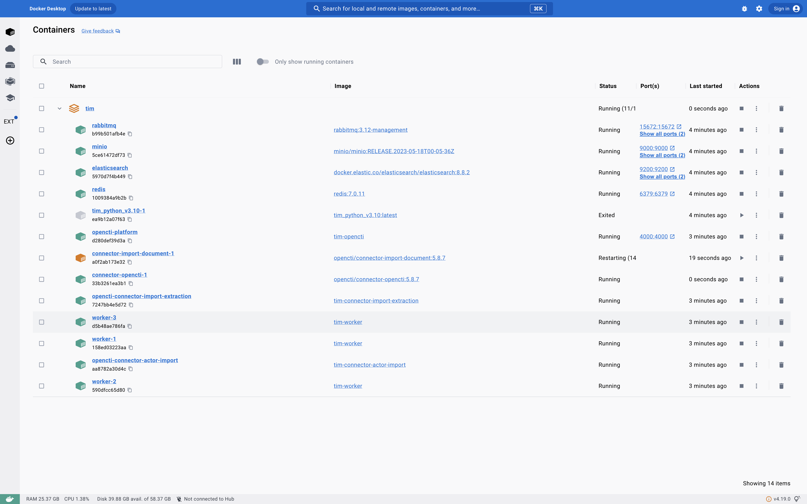

# Overview

The Threat Intel Management (TIM) instantiation of OpenCTI has been Docker-ized.  The main reason for this is that the Structured Threat Information Expression (STIX) language has been extended to enable a richer characterization of Identities and Threat Actors, as well as, financial data.

The extensions have required changes to the following code bases:

[Threat Intel / OpenCTI / Opencti](https://gitlab.324cate.com/threat-intel/opencti/opencti)

[Threat Intel / OpenCTI / Client Python](https://gitlab.324cate.com/threat-intel/opencti/client-python)

[Threat Intel / OpenCTI / Connectors](https://gitlab.324cate.com/threat-intel/opencti/connectors)

[Threat Intel / OpenCTI / Docker](https://gitlab.324cate.com/threat-intel/opencti/docker)

Each of the repo's contain files that begin with TIM.* that support this capability.

Prior to starting the setup steps please have [Docker Desktop](https://www.docker.com/products/docker-desktop/) installed on your system.

# Setup

## Connectors

Within the ```~/projects/threat_intel/docker/TIM.docker-compose.yml``` file, starting at about line #187, uncomment the additional connectors that you require.

# Execute

Within the ```docker``` repository, run the ```./TIM.setup.sh``` script:

```
usage: ./TIM.setup.sh [-dghrUv] [-b (branch)] [-D (directory)]

  Setup and run OpenCTI with TIM in a Docker environment.
    -v [visibility] PRIVATE (default) or PUBLIC.  Determines BRANCH, GIT_URL and BASE_DIR.
    -b [branch] branch to clone from (defaults are PRIVATE: master-TIM; PUBLIC: master)
    -D [directory] (defaults are PRIVATE: ~/projects/threat_intel; PUBLIC: ~/projects/threat_intel_public)
    -d [destroy] remove all containers built by the tim project
    -g overwrite existing environment and configutation files with base config
    -r [run] docker creation
    -U [update] branch by executing a git pull, if previously cloned
    -h this help message
```

This will build all the Docker images and start the containers.  It takes ~10 minutes to run, so be prepared.  Once the script completes, within the terminal window you will see:


Within Docker Desktop, you will see:




And, TIM OpenCTI can be accessed from:  [http://localhost:4000/dashboard](http://localhost:4000/dashboard)
